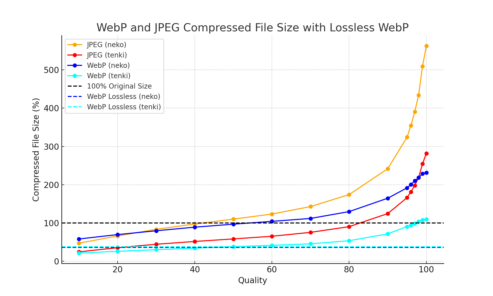
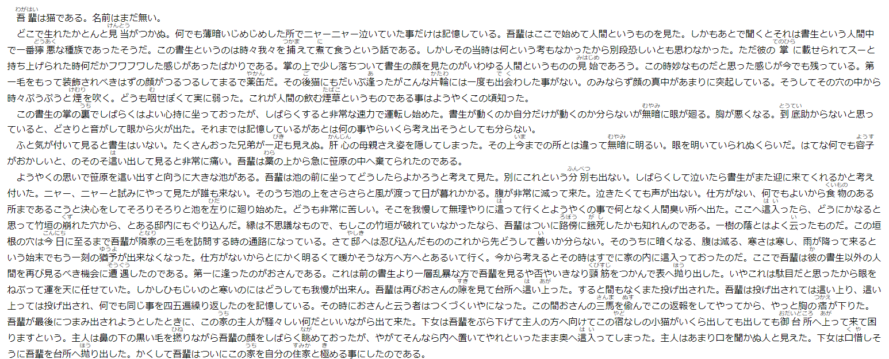
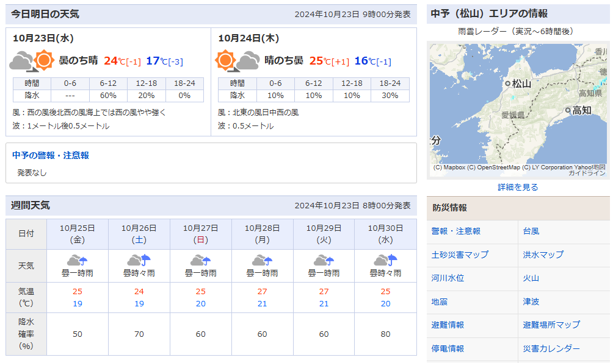
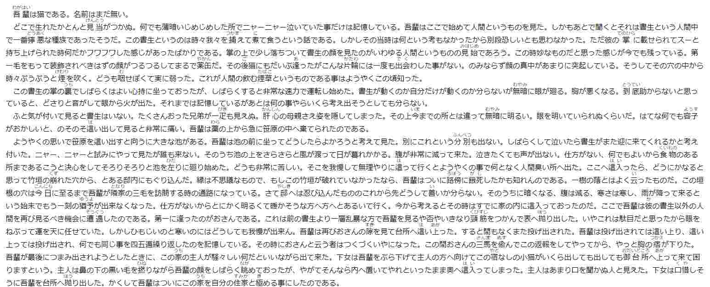
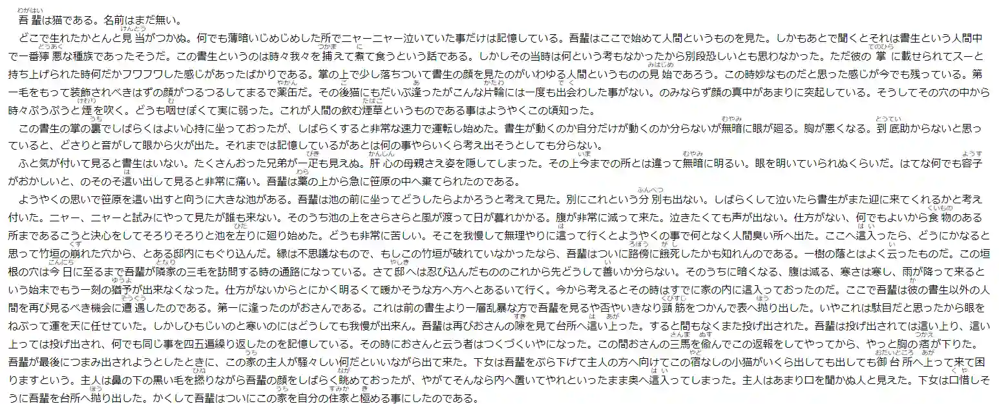
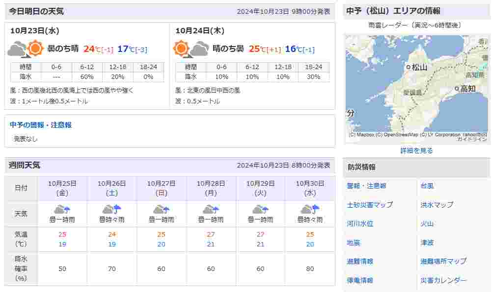
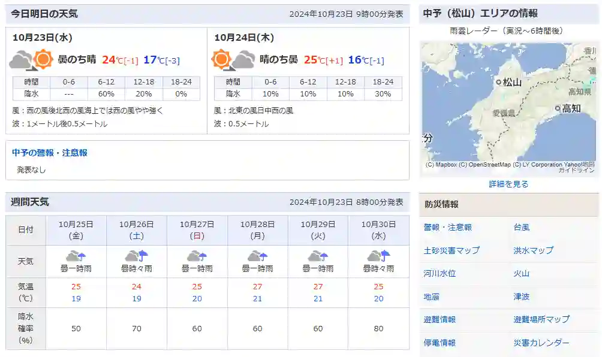
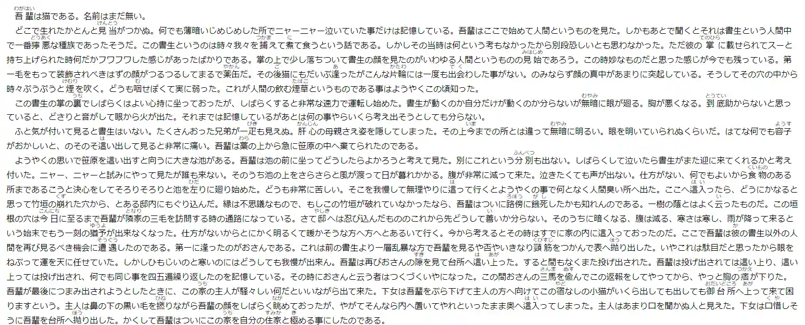
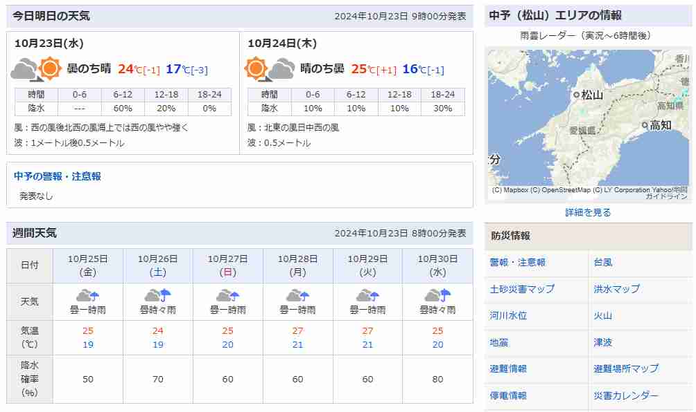

# WebP vs JPEG: 圧縮性能の包括的比較

## TL;DR

以下のグラフに示されるように、WebPはJPEGに対して優れた圧縮性能を発揮しました。
**Lossy 70%クォリティのWebP**と**Lossless WebP**のうち、小さい方を採用することが最も効果的です。

この調査では、**WebP**と**JPEG**の圧縮技術のパフォーマンスを比較し、**非可逆圧縮**と**可逆圧縮**の両方に焦点を当てています。サンプル画像として「neko」と「tenki」の2枚を使用し、圧縮品質とファイルサイズの関係を調査しました。これにより、これら2つのフォーマットが異なる品質レベルでどのように機能するかを視覚的および定量的に分析しました。

### 元の画像

この記事で使用した2枚の元の画像は以下の通りです：

- 
  *neko.png 195 KBのPNG画像*

- 
  *tenki.png 109 KBのPNG画像*

これらの画像を、WebPおよびJPEGの圧縮パフォーマンスをさまざまな品質設定で比較するための基準としました。

### 探索した圧縮技術

1. **非可逆圧縮**: WebPおよびJPEGの両方について、**10**から**100**の品質レベルで画像を圧縮しました。10ごとに品質レベルを設定し、段階的な変化を観察しました。また、**95, 96, 97, 98, 99**の品質も追加し、高品質設定における微妙な違いを捉えました。

2. **可逆圧縮**: さらに、**WebPの可逆圧縮モード**を使用し、品質を保ちながらどの程度ファイルサイズを削減できるかを検証しました。

### ファイルサイズと圧縮率

圧縮結果は元のPNGファイルと比較され、圧縮率は元のファイルサイズに対する割合として計算されました：

- **JPEG**および**WebP**ファイルは、圧縮効率において異なる結果を示しました。
- WebPは一般的に低品質レベルで優れた性能を発揮し、JPEGよりも小さいファイルサイズを生成しながら、視覚的な忠実度を維持しました。
- **可逆WebP**は元のPNGサイズの約**35-38%**のファイルサイズ削減を達成し、品質を維持しながらの圧縮効果が高いことを示しました。

詳細な比較表には以下が含まれます：

- **元のファイル名**
- **元のファイルサイズ**
- **品質レベル**
- **圧縮後のファイル形式 (JPEG または WebP)**
- **圧縮後のファイルサイズ**
- **元のファイルサイズに対する割合**

### 目視による画像の比較

## Quality 10のJPEGとWebP

<table><tr>
<td>

Original PNG

</td>
<td>

Quality 10 JPEG

</td>
<td>

Quality 10 WebP

</td>
</tr>
<tr>
<td>

Original PNG

</td>
<td>

Quality 10 JPEG

</td>
<td>

Quality 10 WebP

</td>
</tr></table>

## Quality 20のJPEGとWebP

<table><tr>
<td width="30%">

Original PNG

</td>
<td width="30%">

Quality 10 JPEG

</td>
<td width="30%">

Quality 10 WebP

</td>
</tr>
<tr>
<td>

Original PNG

</td>
<td>

Quality 20 JPEG

</td>
<td>

Quality 20 WebP

</td>
</tr></table>

### 視覚的な比較

また、**元のサイズに対する圧縮後のファイルサイズの割合**を**品質レベル**に対してプロットし、結果を視覚化しました。各圧縮方式（JPEGとWebP）は異なる色で表現し、**可逆WebP**の圧縮は特定の品質レベルに依存しないため、水平の破線で描画しました。

- **JPEG**の線は**暖色系**（例：赤、オレンジ）で描きました。
- **WebP**の線は**寒色系**（例：青、シアン）で描きました。
- **100%の元のサイズ**のラインは、参照しやすいように黒の破線で示しました。

### 主な観察結果

1. **非可逆 vs. 可逆**: WebPの可逆圧縮は一貫して元のPNGよりも小さいファイルサイズを提供しましたが、JPEGには同様の真の可逆圧縮モードが存在しません。
2. **ファイルサイズの傾向**: 両方の画像において、WebPは同等の品質レベルでJPEGよりも小さいファイルサイズを生成し、特に低品質レンジでその優れた圧縮効率を示しました。
3. **高品質設定**: 高品質設定（例：**90以上**）では、JPEGとWebPのファイルサイズの差はあまり大きくありませんが、ほとんどの場合、WebPがわずかに優位性を保ちました。

### 結論

この研究により、特に**低から中品質の非可逆圧縮**および**可逆シナリオ**において、WebPのJPEGに対する優位性が明らかになりました。WebPは、視覚的品質を維持しながら一貫してより小さいファイルサイズを提供しました。これにより、WebPは、**帯域幅**と**画像品質**が重要な考慮事項である現代のウェブおよびアプリケーション開発において強力な候補となります。

この分析で使用した詳細なプロットおよび画像は参照可能です。さらに深く掘り下げたい場合は、すべての処理済み画像および比較グラフを**ZIP**ファイルにまとめてダウンロード可能です。

