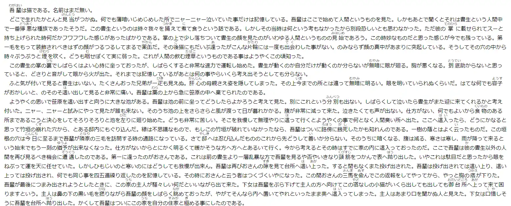
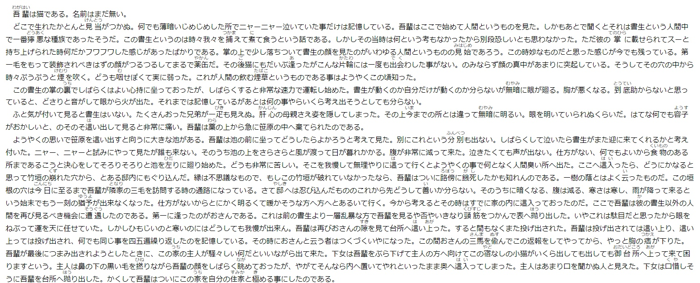

# スクリーンショットはWebPが良い

以下のグラフに示されるように、WebPはJPEGに対して優れた圧縮性能を発揮する。
WebPでは元となる画像によっては可逆圧縮のほうが非可逆圧縮よりも圧縮効率が良い。
したがって
**Lossy 70%クォリティのWebP**と**Lossless WebP**のうち、小さい方を採用するのが良い。

### 目視による画像の比較
この記事で使用した2枚の元の画像は以下の通りです：

- 
  *neko.png 195 KBのPNG画像*

- 
  *tenki.png 109 KBのPNG画像*

変換前のオリジナルのPNG画像とWebP画像とJPEG画像を並べます。

## Quality 10のJPEGとWebP

<table><tr>
<td>

Original PNG

</td>
<td>

Quality 10 JPEG

</td>
<td>

Quality 10 WebP

</td>
</tr>
<tr>
<td>

Original PNG

</td>
<td>

Quality 10 JPEG

</td>
<td>

Quality 10 WebP

</td>
</tr></table>

## Quality 20のJPEGとWebP

<table><tr>
<td>

Original PNG

</td>
<td>

Quality 20 JPEG

</td>
<td>

Quality 20 WebP

</td>
</tr>
<tr>
<td>

Original PNG

</td>
<td>

Quality 20 JPEG

</td>
<td>

Quality 20 WebP

</td>
</tr></table>

<h2>Quality 30のJPEGとWebP</h2>

<table><tr>
<td>

Original PNG

</td>
<td>

Quality 30 JPEG

</td>
<td>

Quality 30 WebP

</td>
</tr>
<tr>
<td>

Original PNG

</td>
<td>

Quality 30 JPEG

</td>
<td>

Quality 30 WebP

</td>
</tr></table>

<h2>Quality 40のJPEGとWebP</h2>

<table><tr>
<td>

Original PNG

</td>
<td>

Quality 40 JPEG

</td>
<td>

Quality 40 WebP

</td>
</tr>
<tr>
<td>

Original PNG

</td>
<td>

Quality 40 JPEG

</td>
<td>

Quality 40 WebP

</td>
</tr></table>

<h2>Quality 50のJPEGとWebP</h2>

<table><tr>
<td>

Original PNG

</td>
<td>

Quality 50 JPEG

</td>
<td>

Quality 50 WebP

</td>
</tr>
<tr>
<td>

Original PNG

</td>
<td>

Quality 50 JPEG

</td>
<td>

Quality 50 WebP

</td>
</tr></table>

<h2>Quality 60 のJPEGとWebP</h2>

<table><tr>
<td>

Original PNG

</td>
<td>

Quality 60 JPEG

</td>
<td>

Quality 60 WebP

</td>
</tr>
<tr>
<td>

Original PNG

</td>
<td>

Quality 60 JPEG

</td>
<td>

Quality 60 WebP

</td>
</tr></table>

<h2>Quality 70 のJPEGとWebP</h2>

<table><tr>
<td>

Original PNG

</td>
<td>

Quality 70 JPEG

</td>
<td>

Quality 70 WebP

</td>
</tr>
<tr>
<td>

Original PNG

</td>
<td>

Quality 70 JPEG

</td>
<td>

Quality 70 WebP

</td>
</tr></table>

<h2>Quality 80 のJPEGとWebP</h2>

<table><tr>
<td>

Original PNG

</td>
<td>

Quality 80 JPEG

</td>
<td>

Quality 80 WebP

</td>
</tr>
<tr>
<td>

Original PNG

</td>
<td>

Quality 80 JPEG

</td>
<td>

Quality 80 WebP

</td>
</tr></table>

<h2>Quality 90 のJPEGとWebP</h2>

<table><tr>
<td>

Original PNG

</td>
<td>

Quality 90 JPEG

</td>
<td>

Quality 90 WebP

</td>
</tr>
<tr>
<td>

Original PNG

</td>
<td>

Quality 90 JPEG

</td>
<td>

Quality 90 WebP

</td>
</tr></table>

<h2>Quality 95 のJPEGとWebP</h2>

<table><tr>
<td>

Original PNG

</td>
<td>

Quality 95 JPEG

</td>
<td>

Quality 95 WebP

</td>
</tr>
<tr>
<td>

Original PNG

</td>
<td>

Quality 95 JPEG

</td>
<td>

Quality 95 WebP

</td>
</tr></table>

<h2>Quality 96 のJPEGとWebP</h2>

<table><tr>
<td>

Original PNG

</td>
<td>

Quality 96 JPEG

</td>
<td>

Quality 96 WebP

</td>
</tr>
<tr>
<td>

Original PNG

</td>
<td>

Quality 96 JPEG

</td>
<td>

Quality 96 WebP

</td>
</tr></table>

<h2>Quality 97 のJPEGとWebP</h2>

<table><tr>
<td>

Original PNG

</td>
<td>

Quality 97 JPEG

</td>
<td>

Quality 97 WebP

</td>
</tr>
<tr>
<td>

Original PNG

</td>
<td>

Quality 97 JPEG

</td>
<td>

Quality 97 WebP

</td>
</tr></table>

<h2>Quality 98 のJPEGとWebP</h2>

<table><tr>
<td>

Original PNG

</td>
<td>

Quality 98 JPEG

</td>
<td>

Quality 98 WebP

</td>
</tr>
<tr>
<td>

Original PNG

</td>
<td>

Quality 98 JPEG

</td>
<td>

Quality 98 WebP

</td>
</tr></table>

<h2>Quality 99 のJPEGとWebP</h2>

<table><tr>
<td>

Original PNG

</td>
<td>

Quality 99 JPEG

</td>
<td>

Quality 99 WebP

</td>
</tr>
<tr>
<td>

Original PNG

</td>
<td>

Quality 99 JPEG

</td>
<td>

Quality 99 WebP

</td>
</tr></table>

<h2>Quality 100 のJPEGとWebP</h2>

<table><tr>
<td>

Original PNG

</td>
<td>

Quality 100 JPEG

</td>
<td>

Quality 100 WebP

</td>
</tr>
<tr>
<td>

Original PNG

</td>
<td>

Quality 100 JPEG

</td>
<td>

Quality 100 WebP

</td>
</tr></table>

